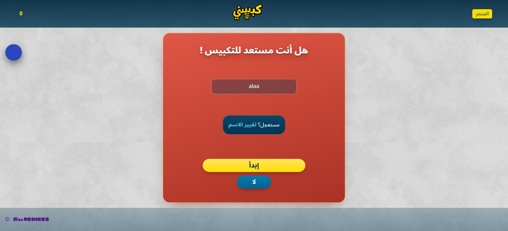

# 🎮 كبسني — *Kabisni*

**لعبة ضغط عربية مجنونة في المتصفح: كبّس، حارب الهورينغ، لا تثق بلهنت… وواجه الزعيم!**

[](https://alaa-mekibes.github.io/kabisni/)
[](https://github.com/alaa-mekibes/kabisni)
[](https://github.com/alaa-mekibes/kabisni)

> **كبسني** ليست مجرد لعبة… إنها أسلوب حياة. اضغط على الشكل، اجمع الزمبيط، واشترِ السكنات — لكن احذر: الهورينغ يلتهم نقاطك، ولهنت… لهنت لديه عرض لا يُقاوَم. 👀



## 🚀 العب فوراً — بدون حساب

| | |
|---|---|
| 🌐 **الموقع الحي** | [alaa-mekibes.github.io/kabisni](https://alaa-mekibes.github.io/kabisni/) |
| 📝 **الدخول** | اكتب اسمك فقط — يُحفظ على جهازك، لا بريد ولا كلمة مرور |

## 🎯 كيف تلعب؟

1. **💥 كبّس الشكل** — كل ضغطة = نقطة + زمبيط.
2. **🛒 افتح المتجر** — اشترِ الأشكال والألوان والحركات (skins, colors, animations).
3. **🦗 اقتل الهورينغ** — من الثانية 50 تبدأ الغارة: حشرة كل ثانيتين، كل واحدة تأكل نقطة في الثانية. **اضغط عليها مرتين!**
4. **👾 اهزم الزعيم** — بعد الغارة يظهر زعيم Voxel ثلاثي الأبعاد: **20 ضربة** (لكنه يغضب في المنتصف!).
5. **💾 احفظ تقدمك** — زر الحفظ يُفتح بعد 10 ثوانٍ.

## ⏱️ خط زمني الجولة

| الثانية | الحدث |
|---|---|
| 0 | التكبيس يبدأ |
| 2 | 🛸 عبور الغازي (Space Invader) مع صوت الليزر |
| 18 | الغازي يختفي… |
| 20 | 👀 **لهنت** يعرض عليك +9999 نقطة — قبول العرض = صفحة الغشاشين! |
| 50 | 🦗 غارة الهورينغ (حتى 10 حشرات) |
| بعد الغارة | 👾 **الزعيم ثلاثي الأبعاد** — 20 ضربة والنصر لك |

## ✨ المميزات

- **🆓 مجانية وبدون حساب** — اسم فقط والعب.
- **🎨 متجر كامل** — 8 أشكال، 10 ألوان، حركات، كلها تُفتح باللعب.
- **🔊 أجواء صوتية مولّدة** — رياح/مطر/أمواج/رعد من قائمة الأصوات في المتجر (بدون ملفات صوتية!).
- **👁️ مكافحة غش** — عدّاد نقرات، بصمة للنتائج، ولهنت نفسه فخ للغشاشين.
- **📱 تعمل في كل مكان** — ملف واحد يُفتح مباشرة، أو أي سيرفر ستاتيك.
- **🌙 صفحة غشاش مرعبة** — Glitch ودماء لمن يحاول الغش (تستحق المشاهدة… مرة واحدة 😈).

## 🛠️ التقنية

- **HTML + CSS + JavaScript فقط** — لا فريمورك، لا بناء، لا مدير حزم.
- **Three.js (r147)** مضمّن محلياً لمرحلة الزعيم فقط — باقي اللعبة 2D خفيفة.
- الحفظ في `localStorage` — تقدمك لا يغادر جهازك.

```bash
# للتجربة محلياً
python -m http.server
# ثم افتح: http://localhost:8000
```

## 🤝 المساهمة

الأفكار مجنونة؟ ممتاز — هذا مكانها. افتح Issue أو Pull Request:

- مراحل وأعداء جدد 👾
- وصفات أجواء صوتية جديدة 🌧
- تحسينات الزعيم ثلاثي الأبعاد 🎯

---

**⚡ صُنعت بحب وجنون — [Alaa MEKIBES](https://github.com/alaa-mekibes)**
